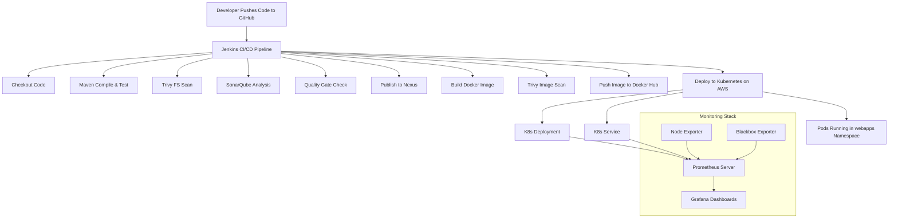
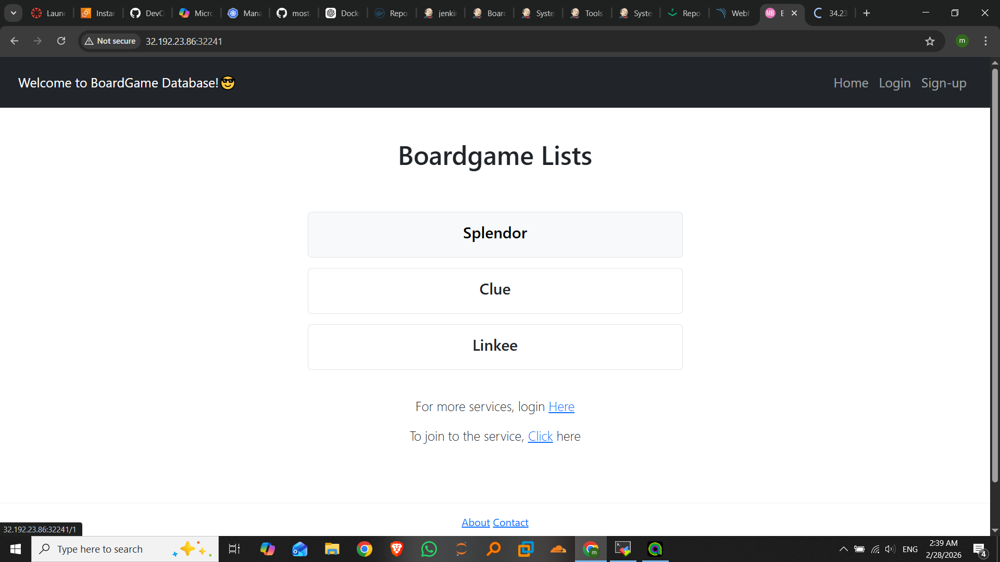
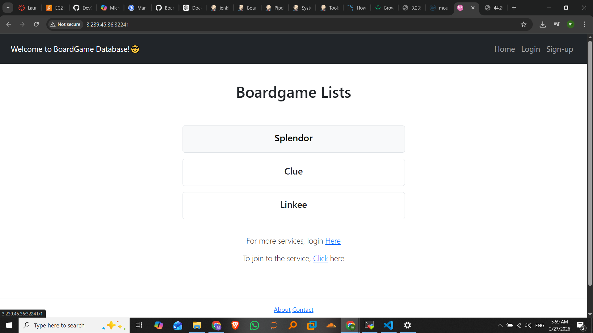
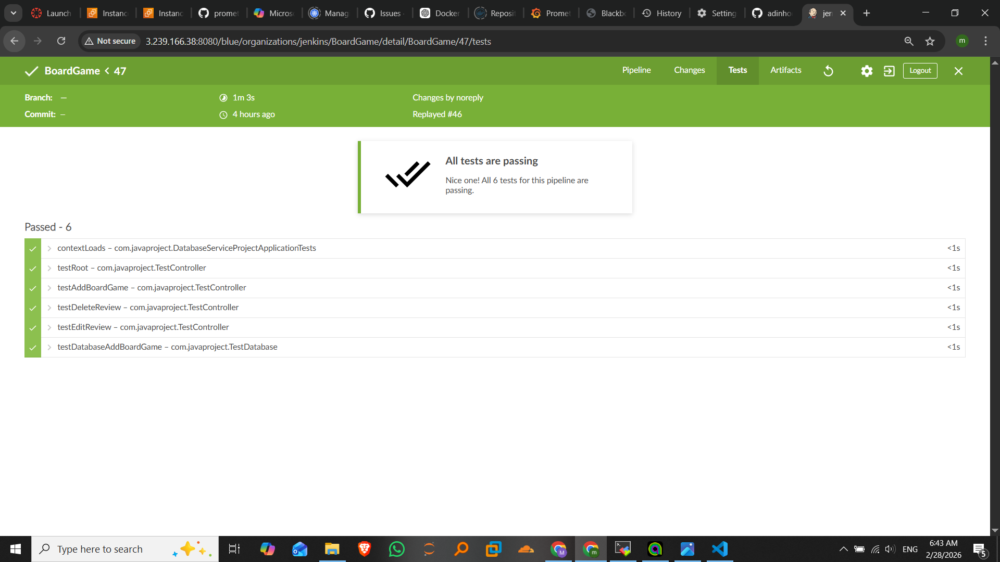
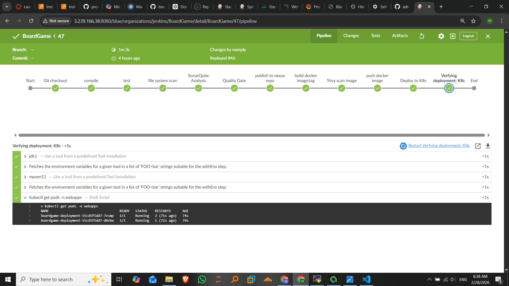
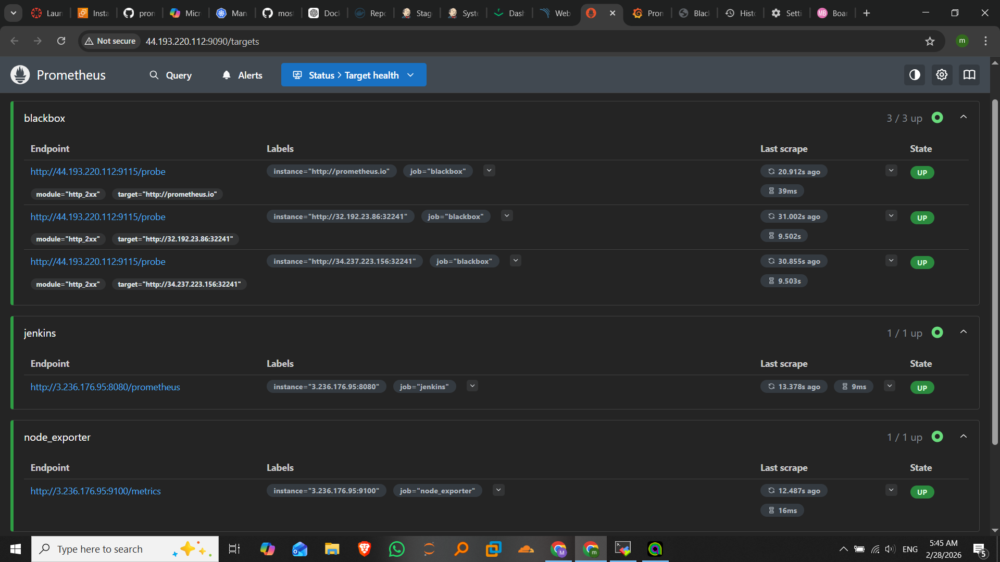
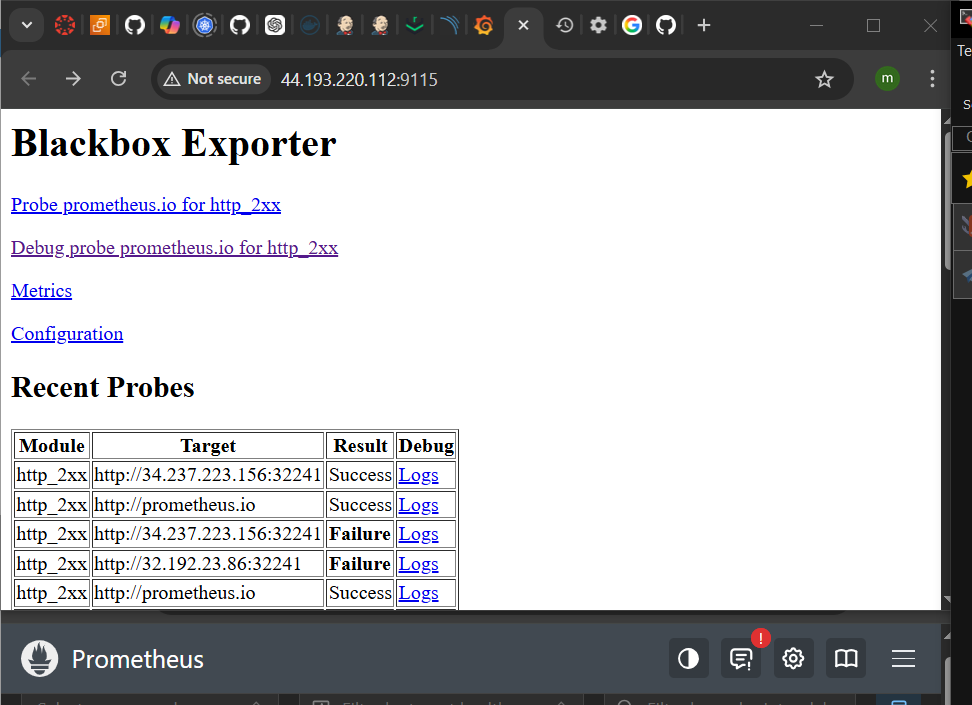
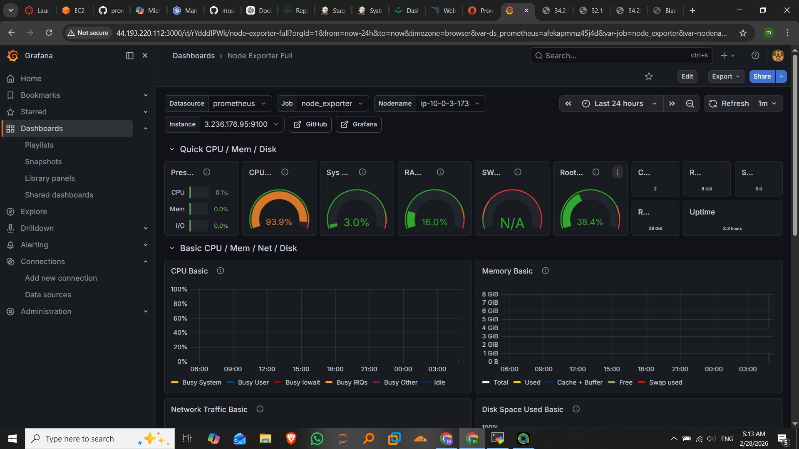

# BoardGame – CI/CD Pipeline on AWS with Jenkins, Docker, Kubernetes, Prometheus & Grafana


This repository contains the *BoardGame* Java application and a complete CI/CD pipeline built using Jenkins. The pipeline automates compilation, testing, security scanning, code quality analysis, artifact publishing, Docker image creation, Kubernetes deployment on AWS, and full monitoring using Prometheus and Grafana.

---

##  Overview

This project demonstrates a full DevOps workflow using modern tools and cloud-native technologies. It covers:

- Continuous Integration with Jenkins  
- Automated testing and code quality checks  
- Security scanning using Trivy  
- Artifact management with Nexus  
- Containerization with Docker  
- Deployment to Kubernetes on AWS  
- Monitoring and alerting using Prometheus, Node Exporter, and Blackbox Exporter  
- Visualization using Grafana  

The goal is to provide a production-grade CI/CD pipeline that ensures code quality, security, reliability, and observability.

---

##  Tools & Technologies Used

- **Jenkins** – CI/CD automation  
- **Maven** – Build and dependency management  
- **SonarQube** – Code quality and static analysis  
- **Trivy** – Security scanning (filesystem + Docker images)  
- **Nexus Repository Manager** – Artifact storage  
- **Docker** – Containerization  
- **Docker Hub** – Image registry  
- **Kubernetes (AWS EC2)** – Deployment and orchestration  
- **Prometheus** – Metrics collection  
- **Node Exporter** – Node-level metrics  
- **Blackbox Exporter** – Endpoint probing  
- **Grafana** – Dashboards and visualization  

---

##  System Architecture


---

## Jenkinsfile (Full CI/CD Pipeline)

```groovy
pipeline {
    agent any
    tools {
        jdk 'jdk1'
        maven 'maven11'
    }
    environment  {
        SCANNER= tool 'sonarqubescan'
    }

    stages {
        stage('Git checkout') {
            steps {
                git branch: 'main', credentialsId: 'git-cred', url: 'https://github.com/mostafa566/BoardGame.git'
            }
        }
        stage('compile') {
            steps {
                sh "mvn compile"
            }
        }
        stage('test') {
            steps {
                sh "mvn test"
            }
        }
        stage('file system scan') {
            steps {
                sh "trivy fs --format table -o trivy-fs-report.html ."
            }
        }
        stage('SonarQube Analysis') {
            steps {
                withSonarQubeEnv('sonarserver') {
                    sh ''' $SCANNER/bin/sonar-scanner -Dsonar.projectName=BoardGame -Dsonar.projectKey=BoardGame \
                            -Dsonar.java.binaries=. '''
                }
            }
        }
        stage('Quality Gate') {
            steps {
                script {
                  waitForQualityGate abortPipeline: true, credentialsId: 'token' 
                }
            }
        }
        
        stage('publish to nexus repo') {
            steps {
                withMaven(globalMavenSettingsConfig: 'global', jdk: 'jdk1', maven: 'maven11', traceability: true) {
                    sh "mvn deploy"
                }
            }
        }
        stage('build docker image:tag') {
            steps {
                script{
                    withDockerRegistry(credentialsId: 'dockerhub-cred') {
                        sh " docker build -t moustapha11/mine:latest ."
                    }
                }
            }
        }
        stage('Trivy scan image') {
            steps {
                sh "trivy image  --format table -o trivy-fs-report.html moustapha11/mine:latest"
            }
        }
        stage('push docker image') {
            steps {
                script{
                    withDockerRegistry(credentialsId: 'dockerhub-cred') {
                        sh " docker push  moustapha11/mine:latest "
                    }
                }
            }
        }
        stage('Deploy to K8s ') {
            steps {
                withKubeConfig(caCertificate: '', clusterName: 'kubernetes', contextName: '', credentialsId: 'k8s-token', namespace: 'webapps', restrictKubeConfigAccess: false, serverUrl: 'https://44.222.145.152:6443') {
                    sh "kubectl apply -f deployment-service.yaml"
                }
            }
        }
        stage('Verfying deployment: K8s ') {
            steps {
                withKubeConfig(caCertificate: '', clusterName: 'kubernetes', contextName: '', credentialsId: 'k8s-token', namespace: 'webapps', restrictKubeConfigAccess: false, serverUrl: 'https://44.222.145.152:6443') {
                    sh "kubectl get pods -n webapps "
                }
            }
        }
    }
}

```
---

---

##  Running Project (Screenshots)

### Application UI
The following images show the BoardGame application running on the Kubernetes cluster:




---

##  Test Results



---

##  CI/CD Pipeline View (Jenkins)



---

## Monitoring & Observability

###  Prometheus Dashboard



Prometheus scrapes metrics from:
- Kubernetes components  
- Node Exporter  
- Blackbox Exporter  
- Jenkins  
- Application endpoints  

---

###  Node Exporter Metrics

Node Exporter provides system‑level metrics such as CPU, memory, disk, and network usage.



---

###  Blackbox Exporter

Blackbox Exporter probes HTTP endpoints to verify availability and latency.

Example targets:
- http://prometheus.io  
- http://32.192.23.86:32241  

---

###  Grafana Dashboards

Grafana visualizes all Prometheus metrics with rich dashboards.



---

##  Prometheus Configuration (prometheus.yml)

```yaml
global:
  scrape_interval: 15s

scrape_configs:

  - job_name: 'prometheus'
    static_configs:
      - targets: ['localhost:9090']

  - job_name: 'node-exporter'
    static_configs:
      - targets: ['<EC2-IP>:9100']

  - job_name: 'blackbox'
    metrics_path: /probe
    params:
      module: [http_2xx]
    static_configs:
      - targets:
        - http://prometheus.io
        - http://32.192.23.86:32241
    relabel_configs:
      - source_labels: [__address__]
        target_label: __param_target
      - source_labels: [__param_target]
        target_label: instance
      - target_label: __address__
        replacement: 44.193.220.112:9115
